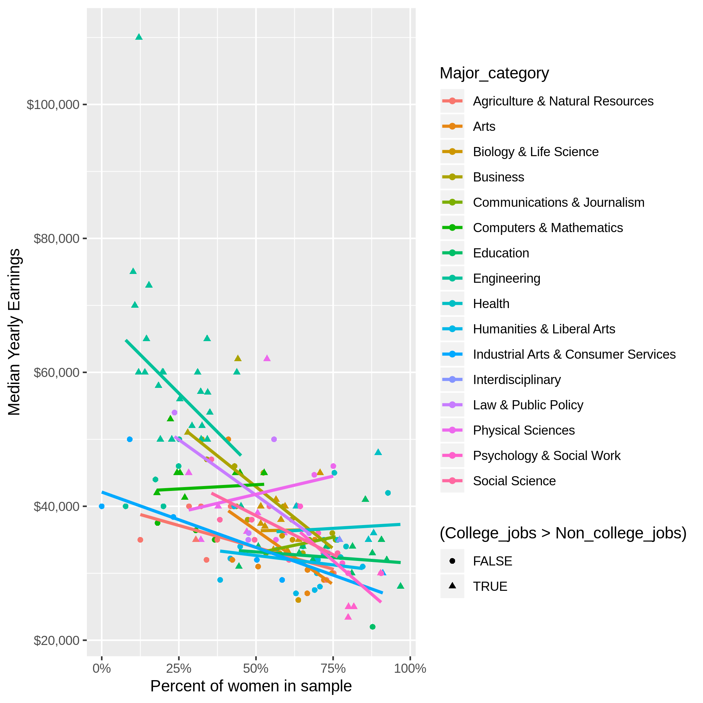

# Plotting in R

We've included some interesting datasets in this directory, and gone and made
some cool plots using these datasets which are displayed below.  Your task is 
to figure out how to use ggplot2 to recreate these plots!  Feel free to expand
and investigate other views of the data as well.

## Datasets

* College Majors (538): Information on demographics and income for several
  disciplines and majors.
* 

## Example Visualizations:

### College Majors:

