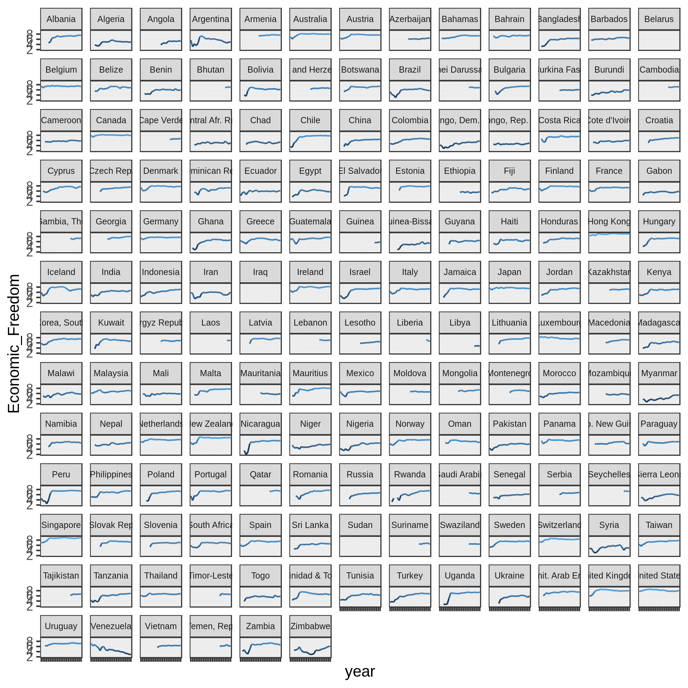

# Plotting in R

We've included some interesting datasets in this directory, and gone and made
some cool plots using these datasets which are displayed below.  Your task is 
to figure out how to use ggplot2 to recreate these plots!  Feel free to expand
and investigate other views of the data as well.

If you're feeling a bit behind on R, check out our workshop from a few weeks
ago here:
[ricedatasci/tidyverse-eda](https://github.com/ricedatasci/tidyverse-eda).  Other
good resources:  
* [R for Data Science](https://github.com/ricedatasci/tidyverse-eda)

## Datasets

* [College Majors (538)](https://github.com/fivethirtyeight/data/tree/master/college-majors): Information on demographics and income for several
  disciplines and majors.
* [Economic Freedom (Kaggle)](https://www.kaggle.com/gsutters/economic-freedom/version/1): Information on the economic freedom over time of
  various nations.

## Example Visualizations:

### College Majors:

### Economic Freedom:

